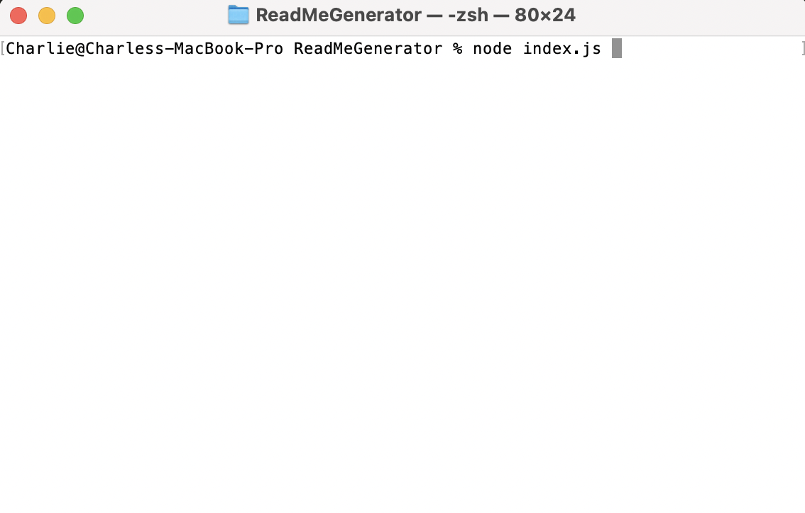

# **Automatic ReadMe Generator**

## Project Description
This is a simple script that automatically generates a high quality readme file for a GitHub repo. Running this script in the command line with node will prompt the user for questions regarding their project such as title, description, installation instructions, type of license, usage information, contribution guidelines, test instructions, GitHub username, and email for contact purposes. Once this information has been collected, the script will automatically generate a README.md file with all the information filled out and formatted professionally. This will save time for software developers and make their GitHub repository look professional to future collaborators, employers, or curious minded developers. 

## Table of Contents:
[Project Install](#project-install)

[License](#license)

[Project Usage](#project-usage)

[Project Contribution](#project-contribution)

[Project Testing](#tests)

[Questions](#questions)

## Project Install:
To install this project, simply fork this repository, and in the command line, navigate to the directory containing the index.js file, and run node index.js. This project uses node and the inquirer version 8.2.4 package. Once the command is executed, the program will run and the first prompt will appear, waiting for user input.

How to run application in command line

## License:
This is where the licensing for the project will be displayed as a badge. Current choices in this program are the MIT License, Apache, Mozilla Public License 2.0, and the GNU General Public License v3.0. This current application is licensed under the Apache license.
Please click the license badge for more information on the license under which this project is covered.

## Project Usage:
Once program is running, simply follow the prompts and type directly into the command line to generate a response, and press enter to submit your response and move on to the next prompt. On list choices, use the arrow keys to toggle up and down to your desired selection, and press enter.

Halfway through filling out inputs:

Finished with inputs:

Video Walkthrough:
[GitHubVideo.webm](https://user-images.githubusercontent.com/103666997/184443214-a3d1ce17-bc92-45cf-a9a8-874f9d608c78.webm)

## Project Contribution:
This is the section to name collaborators on the project or sources where inspiration or content was taken and applied to this project. Links should be provided to all other collaborators or source material.
## Tests:
This section is to list out any future tests for the application and instructions on how to run those tests.
## Questions:
GitHub Username: CMolitor96

GitHub profile: (https://github.com/CMolitor96)

Please email me at (charlie.molitor.38@gmail.com) for any further questions regarding this application.
